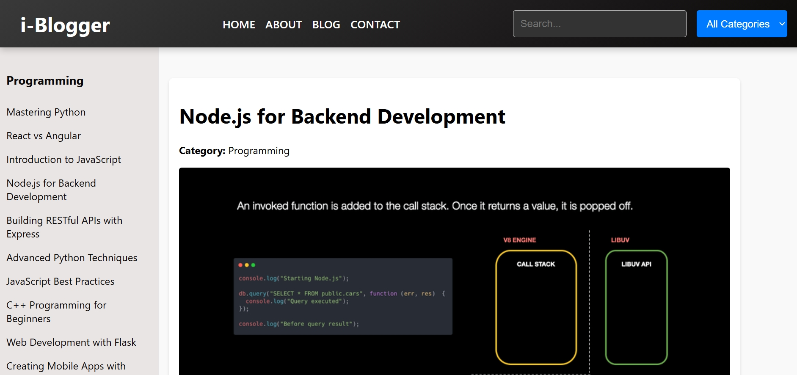

```markdown
# i-Blogger - Educational Tech Blogs (Home-page Only)

i-Blogger is a modern educational blog website that shares insightful articles on the latest technologies, programming tutorials, and industry trends. Built for educational purposes to demonstrate front-end development skills and content presentation.

## Features

- **Responsive Blog-style UI**: Clean, intuitive, and mobile-friendly design.
- **Educational Articles**: Covers programming, technology trends, and tutorials.
- **Easy Navigation**: Categorized content for quick access.
- **Responsive Design**: Optimized for both desktop and mobile devices.

## Screenshots

  

[Live Demo](https://aniketdobriyal.github.io/I--blogger/)

## Technologies Used

- **HTML**: Structuring the web pages.
- **CSS**: Styling and layout of the website.
- **JavaScript**: Adding interactivity and dynamic content.
- **React**: Building reusable components and managing state.

## License

This project is licensed under the MIT License - see the LICENSE file for details.
```

